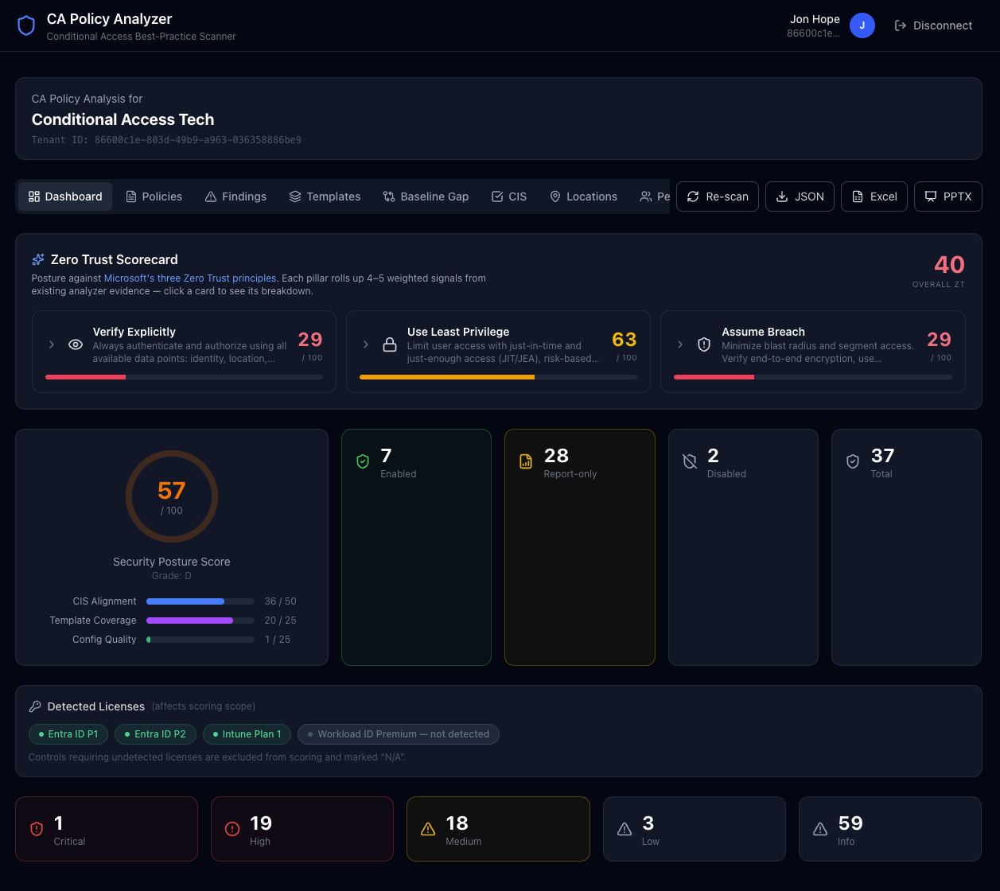
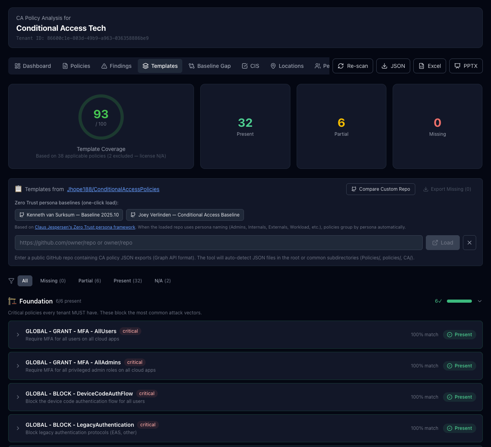
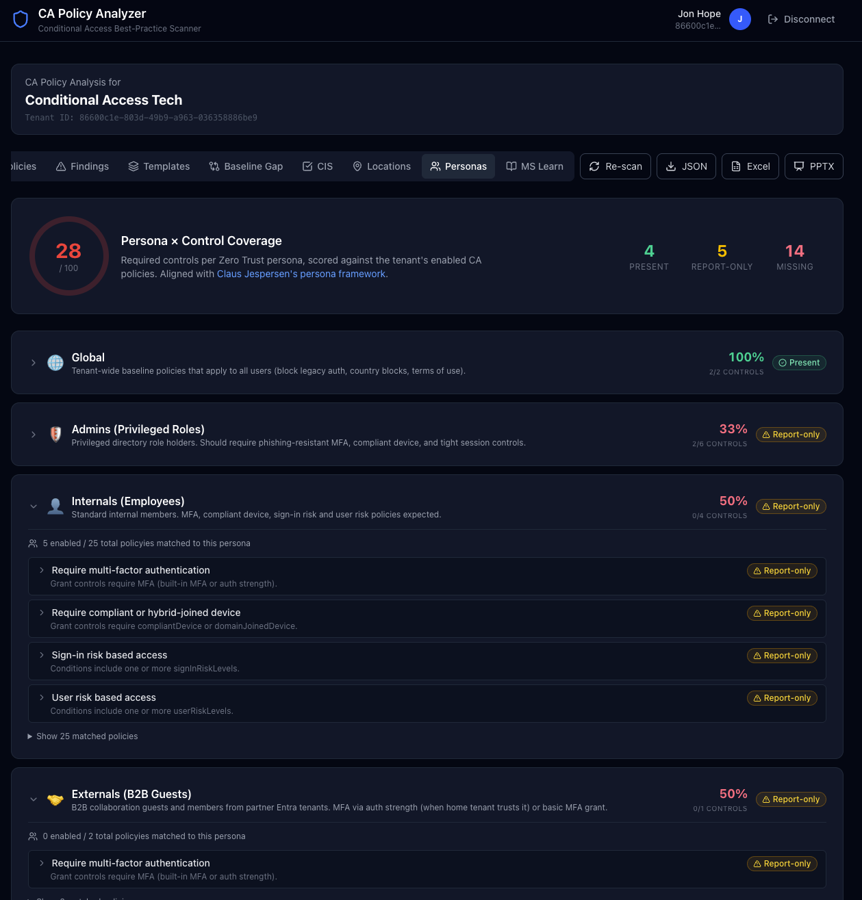
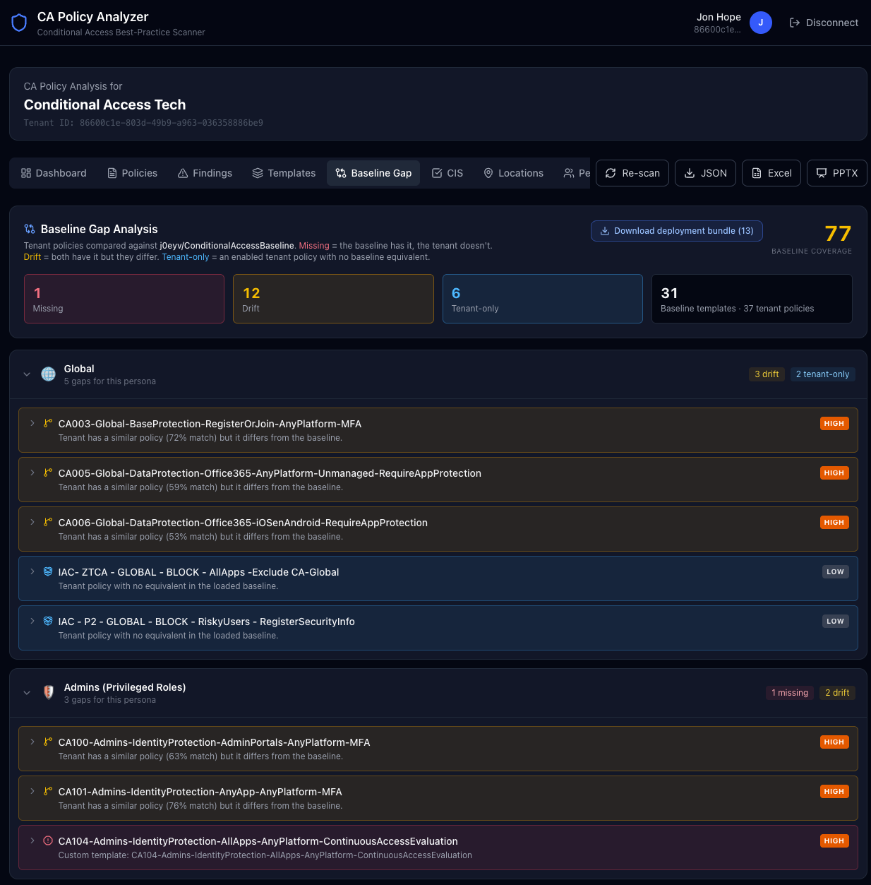

# CA Policy Analyzer

> Analyze your Entra ID Conditional Access policies for best practices, FOCI token-sharing risks, known CA bypasses, CIS v6.0 benchmark alignment, and MS Learn documented exclusions — **directly in your browser, no install required.**

[](https://jhope188.github.io/ca-policy-analyzer)
  

## 🚀 Try It Now

**No download. No install. No server.**

👉 **[https://jhope188.github.io/ca-policy-analyzer](https://jhope188.github.io/ca-policy-analyzer)**

1. Click **Connect Tenant**
2. Sign in with your Entra ID credentials
3. Click **Run Analysis**
4. Explore the nine analysis tabs: Dashboard, Policies, Findings, Templates, Baseline Gap, CIS, Locations, Personas, and MS Learn
5. Click **Export JSON** to download the full analysis results

The app runs **100% in your browser** — your data never leaves your machine. It connects directly to Microsoft Graph using your own credentials (delegated permissions).


---

## Recent Changes

> Only the **5 most recent releases** are summarized here. Full version history lives in [CHANGELOG.md](CHANGELOG.md).

### v1.14.3 — Report-only-aware MFA-for-all-users finding (May 8, 2026)
- **Tenant-wide MFA Coverage check** — previously this finding fired as *critical* ("No policy requires MFA for All Users") whenever no **enabled** policy targeted All Users with MFA, even if a fully-formed **report-only** policy already covered the case. The message read "No enabled policy was found..." which felt wrong to operators who *did* have such a policy in report-only mode.
- The check is now report-only aware: when a report-only policy covers MFA for All Users, the finding is downgraded from **critical → medium**, retitled "**MFA for All Users exists but is Report-only**", and references the actual policy id/name. Recommendation now reads *"After observing report-only telemetry for 7–14 days with no unexpected blocks, switch this policy to On."*
- Only fires as critical when **neither enabled nor report-only** coverage exists.

### v1.14.2 — Phishing-resistant MFA detection fix (May 8, 2026)
- **Zero Trust scorecard** — the *Verify Explicitly → Phishing-resistant MFA in use* signal previously matched only the authentication-strength **displayName** with a regex. Custom strengths like `Modern MFA + TAP` whose `allowedCombinations` *contain* FIDO2 / Windows Hello for Business / x509 certificate MFA were being missed.
- Detection now resolves the policy's `authenticationStrength.id` against `TenantContext.authStrengthPolicies` and inspects `allowedCombinations` directly, plus matches the well-known built-in **Phishing-resistant MFA** strength id `00000000-0000-0000-0000-000000000004`. Tokens treated as phishing-resistant: `fido2`, `windowsHelloForBusiness`, `x509CertificateMultiFactor`, `x509CertificateSingleFactor`, `deviceBoundPasskey`, `hardwareOath`.
- Evidence string now names the matching strength so the operator can verify what the engine picked.

### v1.14.1 — Deployment plan now ships as a ZIP bundle (May 8, 2026)
- **"Download deployment bundle"** on the Baseline Gap tab now produces a ZIP with: a Zero Trust criticality-ordered `README.md` (Critical → High → Medium → Low, personas in canonical order within each tier), the original `deployment-plan.json` manifest, and one Graph-ready JSON file per policy at `policies/<persona>/<template>.json`.
- The bundle README bakes in **four auto-import recipes** (Microsoft Graph PowerShell SDK, DCToolbox, `Invoke-MgGraphRequest`, Bash + curl + jq) so the operator can pick the workflow that matches their environment.
- Added `jszip` for in-browser ZIP creation; new `downloadDeploymentBundle()` helper in [src/lib/deployment-plan.ts](src/lib/deployment-plan.ts).

### v1.14.0 — Deployment Plans & Persona-aware PPTX (May 8, 2026)
- **Phase 5 — Deployment Plan Generator**: new "Download deployment plan" button on the Baseline Gap tab exports every *missing* and *drift* policy as a Graph-ready JSON bundle (full conditions/grantControls/sessionControls bodies, persona-grouped, severity-ranked). All bodies are forced to `state=disabled` for safety. PowerShell + DCToolbox import recipes baked in.
- **Phase 6 — Persona-aware PowerPoint export**: PPTX now includes new slides between the policy slides and CIS — **Zero Trust Scorecard** (3 pillar cards with top signals), **Persona × Control Coverage summary** (per-persona table), **per-persona detail slides** (one slide per persona showing score badge, control coverage, and that persona's baseline gaps), and **Baseline Gap** summary. The full Zero Trust framework story now flows automatically into the executive deck.

### v1.13.0 — Baseline Gap Analysis (May 8, 2026)
- **New Baseline Gap tab** that diffs the live tenant against a loaded Zero Trust baseline (Kenneth / Joey / custom GitHub repo / built-in)
- Three actionable buckets: **Missing** (baseline has it, tenant doesn't), **Drift** (both have it but they differ), **Tenant-only** (enabled tenant policies with no baseline equivalent)
- Every gap is grouped by Zero Trust persona so admins/internals/externals/etc. each get their own card with missing / drift / tenant-only counts
- Coverage score 0–100 = `(present + 0.5 × partial) / applicable_templates`
- Toggleable filters, expandable per-entry evidence (closest tenant policy name + concrete differences), severity badges driven by template priority

See [CHANGELOG.md](CHANGELOG.md) for the full version history including v1.12.0 (Zero Trust Scorecard), v1.11.0 (Persona × Control Coverage), v1.10.0 (Zero Trust Persona Framework), v1.9.0 (Custom GitHub Template Comparison) and earlier.

---

## Screenshots

### Dashboard — Security Posture at a Glance

The dashboard shows your overall security score (0–100), policy counts by state, and a severity breakdown of all findings.

<!-- Replace with actual screenshot: open the app → run analysis → Dashboard tab -->


### Policies — Visual Flow Cards

Every CA policy is rendered as an expandable flow card showing Users → Conditions → Apps → Grant/Session Controls. Critical and high-severity policies are highlighted with coloured borders.

<!-- Replace with actual screenshot: open the app → Policies tab → expand a policy -->


### Findings — Severity-Ranked Issues

All detected issues ranked Critical → Info. Expand any finding to see the full description, affected policy, and a remediation recommendation.

<!-- Replace with actual screenshot: open the app → Findings tab → expand a finding -->


### Templates — Gap Analysis & Persona Baselines

39 best-practice templates (including Workload Identity) compared against your tenant. Each template shows whether you have a matching policy, a partial match, or a gap.

**Two built-in Zero Trust persona baselines** load with one click — each follows [Claus Jespersen's persona framework](https://github.com/microsoft/ConditionalAccessforZeroTrustResources):

- **Kenneth van Surksum — Baseline 2025.10** — community-maintained Zero Trust persona baseline, refreshed quarterly. Strong reference for production-grade tenants. ([github.com/kennethvs/cabaseline202510](https://github.com/kennethvs/cabaseline202510))
- **Joey Verlinden — Conditional Access Baseline** — persona-based baseline aligned with Microsoft's Zero Trust guidance. The loader pulls the full DCToolbox-style restore bundle from the repo's `Config/` root: 67 ConditionalAccess policies + 33 exclusion groups + named-locations allow-lists + migration table. ([github.com/j0eyv/ConditionalAccessBaseline](https://github.com/j0eyv/ConditionalAccessBaseline/tree/main/Config))

**Compare against any public GitHub repo** — the **Compare Custom Repo** button accepts:

- a full GitHub URL (e.g. `https://github.com/owner/repo`)
- a branch/path deep link (e.g. `https://github.com/owner/repo/tree/main/policies`)
- `owner/repo` shorthand

The loader auto-detects JSON files, converts Graph-format CA policy exports into templates with auto-generated fingerprints, and matches them against your tenant. Results group by detected Zero Trust persona (Global / Admins / Internals / Externals / GuestAdmins / Developers / CorpServiceAccounts / WorkloadIdentities / M365ServiceAccounts) when persona naming is detected, falling back to CAD/CAL/CAP prefix grouping otherwise.

Claus Jespersen's [original Microsoft persona framework repo](https://github.com/microsoft/ConditionalAccessforZeroTrustResources) is credited as the canonical reference but is no longer wired as a one-click baseline — it is no longer actively maintained as a deployable bundle.

<!-- Open the app → Templates tab -->



### Personas — Zero Trust Persona × Control Coverage

The Personas tab scores your tenant against the required-control matrix for each Zero Trust persona (Global, Admins, Internals, Externals, GuestAdmins, Developers, CorpServiceAccounts, WorkloadIdentities, M365ServiceAccounts). Each persona card lists the 10 expected controls — MFA, phishing-resistant MFA, compliant device, sign-in/user risk, sign-in frequency, legacy auth block, country block, non-corp network block, high-risk app block — and resolves each one to **Present** / **Report-only** / **Missing** with the actual policies that satisfy it. Critical gaps (e.g. Admins missing MFA, Internals missing user-risk) also feed into the Findings tab and exports.

<!-- Open the app → run analysis → Personas tab -->


### Baseline Gap — Diff Against a Zero Trust Baseline

The Baseline Gap tab diffs your live tenant against a loaded Zero Trust baseline (Kenneth van Surksum, Joey Verlinden, Claus Jespersen, or any custom GitHub repo) and groups every difference by persona. Three buckets: **Missing** (baseline has it, tenant doesn't), **Drift** (both sides have it but the configuration differs), **Tenant-only** (enabled tenant policies with no baseline equivalent). Coverage score is `(present + 0.5 × partial) / applicable_templates`. Each entry expands to show the closest tenant policy name and the concrete configuration differences, and the **Download deployment bundle** button packages every missing/drift policy as a ZIP with a criticality-ordered README plus one Graph-ready JSON per policy under `policies/<persona>/<template>.json` for direct import via Graph PowerShell, DCToolbox, `Invoke-MgGraphRequest`, or curl.

<!-- Open the app → load a baseline → Baseline Gap tab -->


### CIS v6.0 — Benchmark Alignment

18 controls from the CIS Microsoft 365 Foundations Benchmark v6.0.0 with an alignment score ring. Each control shows pass/fail status, matching policies, and remediation guidance.

<!-- Replace with actual screenshot: open the app → CIS tab -->


### MS Learn — Documented Exclusion Checks

17 checks sourced from Microsoft Learn flag policies that are missing required exclusions or using deprecated grant controls. Findings are grouped by check type — similar policies are consolidated under a single card showing all affected policies.

<!-- Replace with actual screenshot: open the app → MS Learn tab -->


### Locations — Named Location Cross-Reference

The Locations tab maps every named location (IP ranges, countries, compliant networks) to the Conditional Access policies that reference it — showing whether each location is used as an include or exclude condition. It flags orphaned references, untrusted locations used with "All Trusted Locations", empty country lists, and overly broad IP ranges.

<!-- Replace with actual screenshot: open the app → Locations tab -->


---

## What It Does

CA Policy Analyzer connects to your Entra ID tenant via Microsoft Graph and:

1. **Reads all Conditional Access policies** including users, apps, conditions, and grant/session controls
2. **Checks for best-practice violations** using research from [Fabian Bader](https://cloudbrothers.info/en/conditional-access-bypasses/) and [EntraScopes.com](https://entrascopes.com)
3. **Detects FOCI risks** — if a policy excludes one FOCI app, ALL 45+ family members can share tokens
4. **Flags known CA bypasses** including CA-immune resources, Device Registration Service bypass, resource exclusion scope leaks, and more
5. **Generates a Security Posture Score** (0-100) with severity-ranked findings and actionable recommendations
6. **Visualizes each policy** showing the flow: Users → Conditions → Apps → Grant Controls
7. **Detects Microsoft-managed CA policies** — identifies Microsoft-managed policies in your tenant (legacy auth block, device code flow block, admin MFA, etc.) and flags potential overlap with custom policies
8. **Surfaces active advisories** — CIS controls display relevant M365 Message Center and MS Learn advisories including the approved client app retirement (March 2026), legacy ID Protection risk policy retirement (October 2026), SPO OTP → Entra B2B migration, and Baseline Security Mode policy drafts

## Security Posture Scoring

The Security Posture Score is a **composite 0–100 score** built from three weighted pillars. This ensures the score reflects CIS compliance, best-practice coverage, and real configuration quality — not just one dimension.

### Three-Pillar Model

| Pillar | Max Points | What It Measures |
|---|---|---|
| **CIS Alignment** | 50 | Weighted pass rate of CIS L1/L2 benchmark controls |
| **Template Coverage** | 25 | How well your policies match the 37 best-practice templates |
| **Configuration Quality** | 25 | Deductions based on severity of detected findings |

### Pillar 1: CIS Alignment (50 points)

The CIS component is the dominant factor. Each of the 19 CIS v6.0.0 controls is weighted by level:

- **L1 (Essential) controls** carry **3× weight** — these are baseline controls every tenant must have
- **L2 (Defense-in-depth) controls** carry **1× weight** — hardening measures for advanced security
- Controls marked **N/A** (missing license) are excluded from the calculation

| CIS Result | Points Earned |
|---|---|
| Pass | Full weight (3× for L1, 1× for L2) |
| Manual | 50% of weight |
| Fail | 0 |

The formula: `cisScore = (weightEarned / weightTotal) × 50`

### Pillar 2: Template Coverage (25 points)

Uses a priority-weighted coverage score across the 37 best-practice policy templates. High-priority templates (MFA, legacy auth block, device compliance) contribute more to this score than optional hardening templates.

The formula: `templateScore = (coverageScore / 100) × 25`

### Pillar 3: Configuration Quality (25 points)

Starts at 25 and deducts points for each security finding. Per-severity caps prevent a single category from consuming the entire budget:

| Severity | Deduction per Finding | Cap |
|---|---|---|
| Critical | 5 pts | 15 pts max |
| High | 1.5 pts | 10 pts max |
| Medium | 0.5 pts | 8 pts max |
| Low | 0.25 pts | 3 pts max |

Total deductions are also capped at 25 (the full budget).

### Letter Grades

| Grade | Score Range |
|---|---|
| **A** | 90 – 100 |
| **B** | 80 – 89 |
| **C** | 65 – 79 |
| **D** | 50 – 64 |
| **F** | 0 – 49 |

### Example Score Breakdown

```
CIS Alignment:        42 / 50  (all L1 passing, 2 L2 failing)
Template Coverage:    19 / 25  (76% weighted coverage)
Configuration Quality: 18 / 25  (2 critical, 1 high finding)
───────────────────────────────
Overall Score:         79 / 100  → Grade: C
```

---
7. **Suggests missing policy templates** from [Jhope188/ConditionalAccessPolicies](https://github.com/Jhope188/ConditionalAccessPolicies) — 40 best-practice templates matched against your existing policies
8. **Measures CIS v6.0 alignment** — 18 controls from CIS Microsoft 365 Foundations Benchmark v6.0.0 with pass/fail scoring and active advisories from M365 Message Center
9. **Flags MS Learn documented exclusions** — 17 checks for missing exclusions that Microsoft documents as required (Surface Hub, Teams Rooms, break-glass accounts, token protection prerequisites, Azure VM sign-in, Directory Sync accounts, External Authentication Methods, approved client app retirement, etc.)
10. **Exports full analysis as JSON** — download your results for offline review or integration with other tools
11. **License-aware scoring** — detects your tenant's Entra ID P1, P2, Intune Plan 1, and Workload Identities Premium licenses via the `/subscribedSkus` endpoint and adjusts scoring accordingly. Templates and CIS controls that require licenses you don't have are marked N/A and excluded from gap/pass-fail calculations, so your score reflects only what is achievable with your current licensing.
12. **Workload Identity policy templates** — recommends CA policies for service principals (Entra Connect sync, risky workload identities) that require Workload Identities Premium
13. **Entra ID sync attack database** — 8 attack vectors sourced from [Cloud-Architekt/AzureAD-Attack-Defense](https://github.com/Cloud-Architekt/AzureAD-Attack-Defense) covering credential extraction, certificate backdoors, token replay, and soft/hard match takeover with MITRE ATT&CK TTP mappings

## Interface

The app has nine tabs accessible after running an analysis:

| Tab | What It Shows |
|---|---|
| **Dashboard** | **Zero Trust Scorecard** (Verify Explicitly / Use Least Privilege / Assume Breach — 15 weighted signals across 3 pillars), composite security posture score (0–100), severity breakdown, risk category distribution, and at-a-glance stats |
| **Policies** | Every CA policy visualized as a flow card: Users → Conditions → Apps → Grant/Session Controls. Search, sort by **Most Findings / Name / State**, and expand any policy to see its findings inline |
| **Findings** | All detected issues grouped by category and ranked by severity (Critical → Info) with affected policies and remediation guidance. Filter chips for All / Critical / High / Medium / Low / Info |
| **Templates** | 39 best-practice policy templates compared against your tenant. **One-click load** of two persona-aligned Zero Trust baselines (Kenneth van Surksum 2025.10, Joey Verlinden Conditional Access Baseline including the full DCToolbox Config/ restore bundle) or compare against any public GitHub repo via URL / `owner/repo` shorthand |
| **Baseline Gap** | Diff the live tenant against the loaded baseline grouped by Zero Trust persona — **Missing** / **Drift** / **Tenant-only** buckets, coverage score, and a **Download deployment bundle** button that ships a ZIP of criticality-ordered README + per-policy Graph-ready JSONs for direct import |
| **CIS** | CIS Microsoft 365 Foundations Benchmark v6.0.0 alignment — 18 controls across sections 5.3 (Conditional Access) and 5.4 (Identity Protection & Device Controls) with M365 Message Center advisories surfaced inline |
| **Locations** | Cross-references every named location (IP ranges, countries, compliant networks) with the CA policies that include or exclude it; flags orphaned references, untrusted locations used with "All Trusted Locations", empty country lists, and overly broad IP ranges |
| **Personas** | Tenant scored against the required-control matrix per Zero Trust persona (Global, Admins, Internals, Externals, GuestAdmins, Developers, CorpServiceAccounts, WorkloadIdentities, M365ServiceAccounts) with 10 controls each resolving to **Present** / **Report-only** / **Missing** |
| **MS Learn** | Documented exclusion checks sourced from Microsoft Learn — flags policies missing required exclusions for token protection, Surface Hub, Teams Rooms, break-glass, CAE, External Authentication Methods, and more |

### Export / Download

- **Export JSON** — complete analysis as a JSON file (findings, CIS results, exclusion checks, persona coverage, scorecard, baseline gaps, raw policies)
- **Export PowerPoint** — executive deck including Zero Trust Scorecard, Persona × Control Coverage, per-persona detail slides, baseline gap summary, top findings, and CIS summary
- **Download deployment bundle** (Baseline Gap tab) — ZIP with criticality-ordered README + one Graph-ready JSON per missing/drift policy under `policies/<persona>/<template>.json` and four auto-import recipes (Microsoft Graph PowerShell SDK, DCToolbox, `Invoke-MgGraphRequest`, Bash + curl + jq)

## Key Checks

| Category | What It Detects |
|---|---|
| **MFA Coverage** | No enabled MFA-for-all-users policy. **Report-only aware** — if a report-only policy already covers MFA for All Users, the finding is downgraded from *critical* to *medium* and rewritten as "MFA for All Users exists but is Report-only" with guidance to promote after 7–14 days of telemetry |
| **FOCI Token Sharing** | Excluded apps that belong to the Family of Client IDs — tokens interchangeable across 45+ Microsoft apps |
| **Resource Exclusion Bypass** | Excluding ANY app from "All cloud apps" leaks Azure AD Graph & MS Graph basic scopes |
| **CA-Immune Resources** | 6 Microsoft resources completely excluded from CA enforcement (always notApplied) |
| **Device Registration Bypass** | Device Registration Service ignores location and device compliance — only MFA works |
| **Swiss Cheese Model** | Grant controls using OR instead of AND, missing MFA baseline layer |
| **Legacy Authentication** | Legacy auth clients targeted but not blocked |
| **Known CA Bypass Apps** | Apps with documented CA bypass capabilities (Azure CLI, PowerShell, AAD Connect, etc.) |
| **Phishing-Resistant MFA Detection** | Resolves the policy's `authenticationStrength.id` against the tenant's auth-strength catalog and inspects `allowedCombinations` (FIDO2, Windows Hello for Business, x509 cert MFA, device-bound passkey, hardware OATH) — catches custom strengths whose displayName doesn't include "phishing-resistant" |
| **Guest Authentication Strength** | Detects policies requiring auth strength for guests/externals; flags High when phishing-resistant, Medium when standard MFA |
| **Break-Glass Coverage** | Locates break-glass accounts/groups and flags any enabled policy that does NOT exclude them |
| **Persona × Control Matrix** | Per-persona presence of MFA, phishing-resistant MFA, compliant device, sign-in/user risk, sign-in frequency, legacy auth block, country block, non-corp network block, high-risk app block (10 controls × 9 personas) |
| **Zero Trust Scorecard** | 15 weighted signals across Verify Explicitly / Use Least Privilege / Assume Breach — rolled up from existing analyzer + persona-coverage evidence (no extra Graph calls) |
| **Baseline Drift** | Diff against a loaded Zero Trust baseline (Kenneth / Joey / custom GitHub) — categorizes every difference into Missing / Drift / Tenant-only with concrete configuration deltas |
| **Tenant-Wide Gaps** | Missing MFA-for-all (report-only aware), no legacy auth block, no break-glass accounts |

## CIS Benchmark Controls (v6.0.0)

18 controls from CIS Microsoft 365 Foundations Benchmark v6.0.0:

| Control | Title | Level |
|---|---|---|
| 5.3.1 | MFA required for all users | L1 |
| 5.3.2 | MFA required for administrative roles | L1 |
| 5.3.3 | MFA required for guest and external users | L1 |
| 5.3.4 | Phishing-resistant MFA for administrators | L1 |
| 5.3.5 | MFA required to register or join devices | L1 |
| 5.3.6 | Sign-in risk policy configured | L1 |
| 5.3.7 | User risk policy configured | L1 |
| 5.3.8 | Access from non-allowed countries blocked | L1 |
| 5.3.9 | Legacy authentication blocked | L1 |
| 5.3.10 | Continuous access evaluation not disabled | L1 |
| 5.3.11 | Unknown/unsupported device platforms blocked | L1 |
| 5.3.12 | Device code flow blocked | L1 |
| 5.3.13 | Sign-in frequency for admin portals limited | L2 |
| 5.4.1 | High-risk users blocked | L1 |
| 5.4.2 | High-risk sign-ins blocked | L1 |
| 5.4.3 | Compliant device requirement configured | L2 |
| 5.4.4 | Token protection for sensitive applications | L2 |
| 5.4.5 | App protection policy for mobile devices | L2 |

## MS Learn Documented Exclusion Checks

16 checks sourced from Microsoft Learn documentation:

| Check | Severity | What It Flags |
|---|---|---|
| Token Protection — Apps | High | Targeting "All apps" instead of only Exchange/SPO/Teams/AVD/W365 |
| Token Protection — Platform | High | Not restricting to Windows-only + desktop clients |
| Token Protection — Devices | High | Missing Surface Hub, Teams Rooms, Cloud PC device exclusions |
| Break-glass accounts | Critical | All Users enforcement policies with no user exclusions |
| Surface Hub — MFA | Medium | MFA/compliance policies without Surface Hub exclusion |
| Teams Rooms — MFA | Medium | MFA/auth strength policies without Teams Rooms exclusion |
| Teams Rooms — Sign-in frequency | Medium | Sign-in frequency causing periodic sign-outs |
| Device code flow — Teams Android | Medium | Blocking device code breaks Teams Android remote sign-in |
| Defender Mobile | Medium | Restrictive policies without Defender ATP exclusion |
| Azure VM Sign-In — MFA | Medium | MFA/compliance policies without Azure VM Sign-In app exclusion |
| CAE disabled | High | Policies explicitly disabling continuous access evaluation |
| Sign-in frequency — Individual services | Medium | Targeting individual M365 services breaks Teams |
| Resilience disabled | Medium | Policies disabling resilience defaults |
| All Resources scope change | High | Low-privilege scope exemption ending March 2026 |
| Directory Sync Account | Medium | MFA policy excluding DirSync role — Entra Connect v2.5.76.0+ supports app-based auth ([version history](https://learn.microsoft.com/entra/identity/hybrid/connect/reference-connect-version-history)) |
| External Auth Method (EAM) | High | EAM (DUO, RSA) on All Users policy blocks guests and external vendors who can't enroll |

## Examples

### Example: Finding — FOCI Token Sharing Risk

When the analyzer detects a policy that excludes a FOCI app, it produces a finding like this:

```
┌──────────────────────────────────────────────────────────────┐
│ 🔴 Critical  F-0003  FOCI Token Sharing                     │
│                                                              │
│ FOCI app excluded: Microsoft Teams (1fec8e78-bce4-...)       │
│                                                              │
│ Policy: "Block all except core apps"                         │
│                                                              │
│ This policy excludes Microsoft Teams, which belongs to FOCI  │
│ family "Microsoft Office". Excluding one FOCI member means   │
│ all 45+ apps in the family can share refresh tokens to       │
│ bypass this policy entirely.                                 │
│                                                              │
│ 💡 Recommendation: Instead of excluding FOCI apps from a     │
│    block/MFA policy, create a dedicated allow policy for     │
│    the specific app.                                         │
└──────────────────────────────────────────────────────────────┘
```

### Example: CIS Control — Pass vs Fail

The CIS tab shows each of the 18 v6.0 controls with a pass/fail badge, matched policies, and remediation if failing:

```
✅ 5.3.1 — Ensure multifactor authentication is required for all users    [L1]
   Found 2 policy(ies) requiring MFA for all users and all apps.
   Policies: "CA001 — Require MFA for all users", "Baseline — MFA"

❌ 5.3.4 — Ensure phishing-resistant MFA for administrators               [L1]
   No policy enforces phishing-resistant authentication strength for admin roles.
   Remediation: Create a CA policy targeting admin roles with authentication
   strength set to "Phishing-resistant MFA" (FIDO2, CBA, Windows Hello).

✅ 5.3.10 — Ensure continuous access evaluation is not disabled            [L1]
   No policy disables continuous access evaluation. CAE is active.
```

### Example: MS Learn Exclusion — Token Protection Misconfiguration

If a token protection policy targets "All cloud apps" instead of only the supported services, the MS Learn tab flags it:

```
┌──────────────────────────────────────────────────────────────┐
│ 🔴 Critical — Token Protection: Unsupported App Scope        │
│                                                              │
│ Policy: "Require token protection"                           │
│                                                              │
│ Assessment: Token protection only works with Exchange         │
│ Online, SharePoint Online, and Teams. This policy targets    │
│ "All cloud apps" which will cause sign-in failures for       │
│ unsupported applications.                                    │
│                                                              │
│ 📖 MS Learn Requirement: Target only Exchange Online         │
│    (00000002-0000-0ff1-ce00-000000000000), SharePoint        │
│    Online (00000003-0000-0ff1-ce00-000000000000), and        │
│    Microsoft Teams Services.                                 │
│                                                              │
│ Remediation: Change the policy to target only Exchange       │
│ Online, SharePoint Online, Teams, Azure Virtual Desktop,     │
│ and Windows 365.                                             │
│                                                              │
│ 🔗 https://learn.microsoft.com/en-us/entra/identity/...     │
└──────────────────────────────────────────────────────────────┘
```

### Example: Template Gap — Missing Policy

The Templates tab highlights best-practice policies you haven't implemented yet:

```
❌ Missing — Block legacy authentication
   Template: CA006-Global-BlockLegacyAuthentication
   No matching policy found in your tenant.
   Description: Block Exchange ActiveSync and other legacy
   auth clients for all users.

🟡 Partial match — Require compliant device for mobile
   Template: CA012-Global-RequireCompliantDevice-Mobile
   Your policy "Device compliance — iOS" covers iOS but
   does not include Android. Match score: 62%
```

### Example: Exported JSON Structure

The **Export JSON** button downloads the full analysis. The JSON follows this structure:

```jsonc
{
  "tenantSummary": {
    "totalPolicies": 24,
    "enabledPolicies": 18,
    "reportOnlyPolicies": 4,
    "disabledPolicies": 2,
    "totalFindings": 13,
    "criticalFindings": 2,
    "highFindings": 4,
    "mediumFindings": 5,
    "lowFindings": 1,
    "infoFindings": 1
  },
  "overallScore": 72,
  "findings": [
    {
      "id": "F-0001",
      "policyId": "aaaa-bbbb-...",
      "policyName": "Block all except core apps",
      "severity": "critical",
      "category": "FOCI Token Sharing",
      "title": "FOCI app excluded — entire family can bypass this policy",
      "description": "...",
      "recommendation": "..."
    }
    // ... additional findings
  ],
  "exclusionFindings": [
    {
      "checkId": "token-prot-apps",
      "severity": "critical",
      "title": "Token Protection: Unsupported App Scope",
      "policyName": "Require token protection",
      "assessment": "...",
      "requirement": "...",
      "remediation": "...",
      "docUrl": "https://learn.microsoft.com/..."
    }
    // ... additional exclusion findings
  ],
  "policyResults": [
    // Full policy data + per-policy findings + flow visualization
  ]
}
```

---

## Privacy & Security

- **No backend server** — the app is static HTML/JS/CSS hosted on GitHub Pages
- **No data collection** — your policies, tokens, and tenant data stay in your browser session
- **Delegated auth only** — the app can only do what your signed-in user can do
- **Open source** — review every line of code in this repo

### Required Permissions

The app requests these Microsoft Graph **delegated** permissions when you sign in:

| Permission | Why |
|---|---|
| `Policy.Read.All` | Read Conditional Access policies |
| `Application.Read.All` | Resolve service principal names referenced in policies |
| `Directory.Read.All` | Resolve groups, roles, and users referenced in policies |

All three permissions require **admin consent** — regular users cannot self-consent.

#### Admin Consent

Before non-admin users can sign in, an admin must grant tenant-wide consent to the app. The minimum Entra ID role required to consent depends on the permission type:

| Role | Can Consent? | Notes |
|---|---|---|
| **Cloud Application Administrator** | ✅ Yes | Least-privileged role that can consent to delegated permissions for any app. **Recommended.** |
| **Application Administrator** | ✅ Yes | Can also consent to delegated permissions; slightly broader than Cloud App Admin |
| **Global Administrator** | ✅ Yes | Can always consent, but overprivileged for this task |
| **Privileged Role Administrator** | ❌ No | Cannot consent to app permissions |
| **Security Administrator** | ❌ No | Cannot consent to app permissions |

> **How to consent:** A Cloud Application Administrator (or above) should navigate to the app URL, sign in, and approve the permissions on the consent screen. This grants tenant-wide consent so all other users can use the app without seeing the "Need admin approval" prompt.
>
> Alternatively, an admin can pre-consent via **Entra Admin Center → Enterprise Applications → ca-policy-analyzer → Permissions → Grant admin consent**.

#### Minimum Role to Run the Tool

Once admin consent has been granted, the minimum Entra ID role a user needs to sign in and run the analysis is:

| Role | Works? | Notes |
|---|---|---|
| **Security Reader** | ✅ Yes | **Least-privileged.** Read-only access to CA policies, directory objects, and apps. **Recommended.** |
| **Global Reader** | ✅ Yes | Works but broader than necessary |
| **Conditional Access Administrator** | ✅ Yes | Overprivileged — has write access the tool doesn't need |
| **Regular user (no role)** | ⚠️ Partial | Can read basic directory objects but may not read all CA policy details |

The app uses a multi-tenant app registration — no per-tenant setup needed.

## For Developers

If you want to run locally, fork, or contribute:

### Prerequisites

- Node.js 18+
- npm

### Local Development

```bash
git clone https://github.com/Jhope188/ca-policy-analyzer.git
cd ca-policy-analyzer
npm install
npm run dev
```

Open http://localhost:3000 and click **Connect Tenant**.

> **Note:** The app comes with a built-in Client ID for the hosted app registration. If you fork this project and want to use your own, set `NEXT_PUBLIC_MSAL_CLIENT_ID` in a `.env.local` file.

### Building for Production

```bash
npm run build    # Outputs static site to ./out
```

The GitHub Actions workflow in `.github/workflows/deploy-pages.yml` automatically builds and deploys to GitHub Pages on every push to `main`.

### Architecture

```
src/
├── app/            # Next.js App Router — main page with 6 tab views
├── components/     # Auth provider, header, dashboard, policy list, findings,
│                   #   templates view, CIS view, exclusions view, UI primitives
├── data/           # FOCI database (45 apps), CA bypass database (13 apps),
│                   #   Entra sync attack vectors (8), CIS v6.0 benchmarks (18 controls),
│                   #   policy templates (39), MS Learn documented exclusions (16 checks)
└── lib/            # MSAL config, Graph client, analyzer engine (13 checks),
                    #   template matcher
```

### Tech Stack

- **Next.js 16** — Static export with App Router
- **MSAL.js** — Entra ID authentication (redirect flow)
- **Microsoft Graph** — Reads CA policies, service principals, named locations
- **Tailwind CSS 4** — Dark theme UI
- **TypeScript** — Full type safety across Graph responses and analysis results

## Research Credits

- **Fabian Bader** — Conditional Access bypasses (TROOPERS25)
- **Dirk-jan Mollema & Fabian Bader** — EntraScopes.com
- **Secureworks** — Family of Client IDs Research
- **Cloud-Architekt (Thomas Naunheim)** — [AzureAD-Attack-Defense](https://github.com/Cloud-Architekt/AzureAD-Attack-Defense) playbook — Entra Connect sync attack vectors and mitigations
- **Center for Internet Security (CIS)** — Microsoft 365 Foundations Benchmark v6.0.0
- **Microsoft Learn** — Conditional Access documented exclusions, token protection, Teams Rooms & Surface Hub compatibility

## License

MIT
